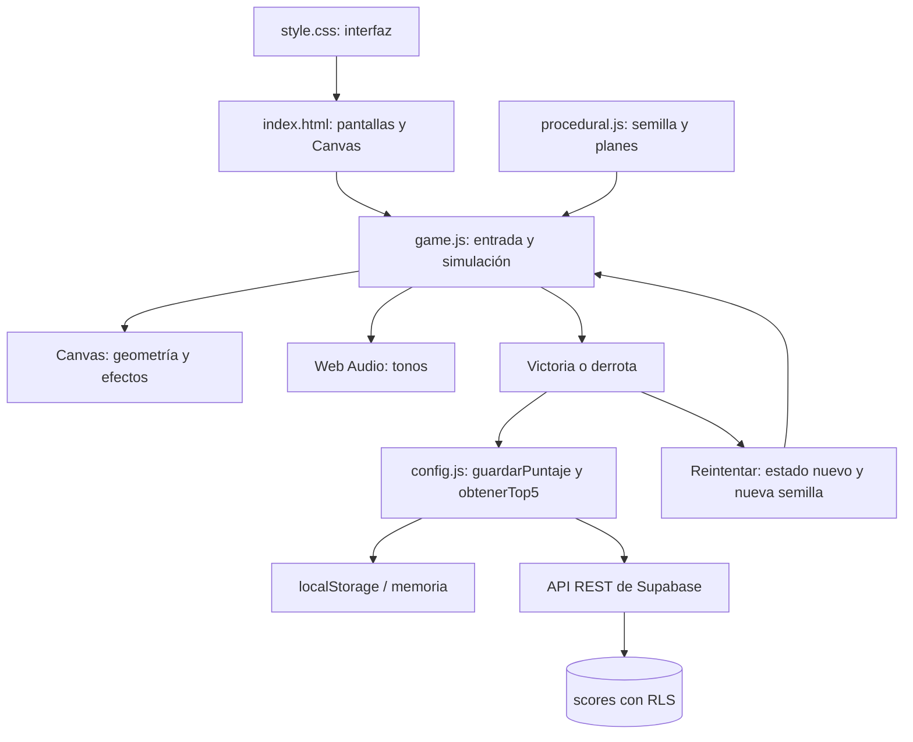

# Call of Malware

Videojuego de supervivencia para Nuevas Tecnologías, Ingeniería en Sistemas y Negocios Digitales. El jugador controla un antivirus y protege el sistema de tres oleadas de malware.

- **Objetivo:** eliminar las amenazas de las tres oleadas sin llegar a cero de integridad.
- **Integrantes:** completar con los nombres del equipo. También se introducen en la pantalla inicial y se usan como nombre del ranking.
- **Repositorio:** https://github.com/gabarimba/Proyecto-videojuego
- **Jugar en GitHub Pages:** https://gabarimba.github.io/Proyecto-videojuego/ (publicado y verificado el 22 de septiembre de 2026).
- **Estado de Supabase:** integración implementada; las constantes están vacías por diseño. Configurar el proyecto para demostrar el ranking en línea.

## Cómo jugar

Abre `index.html` directamente con un navegador moderno. No hay instalación, compilación, servidor propio, fuentes remotas, imágenes, audio descargado ni librerías de terceros. Para jugar se necesita teclado y mouse; la interfaz se adapta a tamaños de laptop y proyector, y puede consultarse en móvil.

| Control | Acción |
|---|---|
| W / A / S / D | Mover el antivirus azul |
| Mouse | Apuntar |
| Clic izquierdo / mantener clic | Disparar / disparar continuamente |
| Esc o botón Pausa | Pausar y continuar |
| M o botón Sonido | Silenciar o activar tonos |

La partida se pausa automáticamente al cambiar de ventana o pestaña. El audio comienza después de pulsar Jugar. Se puede reintentar desde victoria o derrota sin recargar la página.

## Reglas y balance

El antivirus comienza con 100 de integridad y se mueve a 245 unidades por segundo. Cada bala causa 25 de daño. Las oleadas contienen **10, 16 y 23 enemigos**; además aumentan velocidad y resistencia y reducen los intervalos de aparición. Cada transición dura tres segundos. La oleada termina al eliminar al último enemigo, después de que hayan aparecido todos.

| Amenaza | Forma / color | Comportamiento | Vida base | Velocidad base | Daño | Puntos |
|---|---|---|---:|---:|---:|---:|
| Virus | Rombo rojo | Persigue directamente | 36 | 76 | 16 | 10 |
| Gusano | Flecha naranja | Persigue serpenteando | 18 | 128 | 12 | 15 |
| Troyano | Cuadrado doble morado | Persigue despacio, resiste más | 88 | 48 | 24 | 25 |

Al recibir daño, el antivirus parpadea y tiene 0.85 segundos de invulnerabilidad para evitar daño acumulado en cada fotograma. Cada eliminación produce partículas, un tono y texto flotante. La preferencia de movimiento reducido elimina el parpadeo y reduce partículas.

### Zona segura y compra

El cuadrado amarillo siempre está en el mismo lugar. Entrar con **60 créditos** compra automáticamente una mejora única de **+50% de cadencia**: el intervalo pasa de 0.23 a 0.23 / 1.5 segundos. Los créditos se obtienen al eliminar enemigos; gastar créditos no resta los puntos totales del ranking.

Entrar también proporciona un escudo de **2 segundos**, con recarga de **12 segundos** desde su activación. Para volver a activarlo hay que salir y entrar después de la recarga. Salir cancela el escudo. El HUD muestra si estás dentro, el estado del escudo y la compra. La protección temporal evita ganar quedándose indefinidamente en la zona.

## Las dos tecnologías adicionales

### 1. Supabase: ranking en línea con recuperación local

1. Crear un proyecto en Supabase.
2. Abrir `config.js` y ejecutar el SQL de su comentario en el SQL Editor del proyecto. Crea `scores`, índice, restricciones, RLS y permisos limitados de lectura e inserción.
3. Copiar Project URL a `SUPABASE_URL` y una clave pública `anon` o `publishable` a `SUPABASE_ANON_KEY`. **Nunca utilizar `service_role` ni una clave secreta.**
4. Terminar una partida y comprobar que el panel Top 5 indica **EN LÍNEA** y que aparece la fila en Supabase.
5. Desconectar internet o dejar las constantes vacías y terminar otra partida: debe aparecer **LOCAL**.

`guardarPuntaje(nombre, puntos)` guarda siempre una copia local e intenta un POST. `obtenerTop5()` consulta los cinco mejores resultados ordenados por puntuación y fecha. Ambas funciones son asíncronas y usan `try/catch`. Cada petición tiene un límite de cuatro segundos. Si el guardado remoto falla, la pantalla muestra directamente el ranking local que sí contiene esa partida. No hay reenvíos automáticos posteriores, para evitar registros duplicados.

El almacenamiento local conserva hasta 50 resultados. Si `localStorage` está bloqueado, se usa memoria y se avisa que el ranking es temporal. Los nombres se insertan mediante `textContent`; no se ejecuta HTML recibido del ranking. El ranking es una demostración académica y confía en las puntuaciones enviadas por el cliente; RLS restringe operaciones, pero no certifica que una puntuación se haya obtenido jugando.

Referencias oficiales: [API REST de Supabase](https://supabase.com/docs/guides/api/creating-routes), [claves públicas](https://supabase.com/docs/guides/getting-started/api-keys) y [Row Level Security](https://supabase.com/docs/guides/database/postgres/row-level-security).

### 2. Generación procedural con semilla

`nuevaSemilla()` usa `crypto.getRandomValues` y tiene una alternativa si esa API no existe. `mulberry32` produce una secuencia pseudoaleatoria reproducible. El generador prepara el plan de cada oleada: tipo, borde y posición de aparición, tiempo de aparición, fase del serpenteo y variación independiente de **±12% en vida y velocidad**. Los primeros tres enemigos garantizan los tres tipos; el resto se elige al azar.

Cada partida muestra su semilla hexadecimal en el HUD y decimal en el resultado. Para reproducir una secuencia durante la explicación, crear `crearGenerador(12345)` y llamar a `oleada(1, 1000, 650)`, luego 2 y 3. Una semilla igual y las mismas llamadas producen los mismos planes. Las partículas usan otro generador para no cambiar la secuencia de enemigos.

## Arquitectura: resumen de archivos

- `index.html`: estructura de inicio, integrantes, controles, Canvas, HUD, transiciones y resultados con Top 5.
- `style.css`: identidad visual naranja/negra, tipografía local, diseño adaptable y estilos de cada pantalla.
- `game.js`: bucle del juego, entrada, combate, oleadas, mejora, escudo, efectos visuales y Web Audio.
- `config.js`: configuración y SQL de Supabase, funciones asíncronas de ranking y recuperación local o en memoria.
- `procedural.js`: semillas, algoritmo Mulberry32 y planes de aparición con variación de velocidad y vida.
- `tests/verify.cjs`: verificaciones automáticas de reglas, reinicio, generación y errores del ranking; no se carga al jugar.

Estados del juego: `inicio → transicion → jugando → transicion → … → fin`. `pausa` recuerda si se pausó combate o transición. El bucle usa segundos entre fotogramas, movimiento diagonal normalizado y colisión entre el segmento recorrido por una bala y el radio del enemigo.

## Publicación en GitHub Pages

Los mismos archivos sirven en `file://` y en Pages porque se cargan mediante rutas `./` y scripts clásicos con `defer`, sin módulos ni `fetch` para archivos locales.

1. Subir estos archivos a la raíz de la rama `main` del repositorio.
2. En **Settings → Pages**, elegir **Deploy from a branch**, rama **main**, carpeta **/(root)** y guardar.
3. Esperar a que GitHub confirme el despliegue y abrir la URL que muestre Pages.
4. Verificar inicio, una partida, Reintentar y Top 5 desde otro equipo.

`.nojekyll` permite servir los archivos estáticos sin procesamiento de Jekyll. Guía oficial: [configurar la fuente de publicación](https://docs.github.com/en/pages/getting-started-with-github-pages/configuring-a-publishing-source-for-your-github-pages-site).

## Correspondencia con la rúbrica

| Sección 3 | Dónde comprobarla |
|---|---|
| Inicio con nombre, identidad, instrucciones e integrantes | Pantalla inicial |
| Elemento controlable y mecánica de interacción | Antivirus azul, WASD, apuntado y disparo |
| Objetivo definido | Introducción y aviso permanente bajo la arena |
| Indicadores de progreso | Integridad, puntos, oleada y créditos |
| Enemigos o amenazas | Virus, gusanos y troyanos |
| Tres etapas progresivas | Oleadas de 10, 16 y 23 enemigos con estadísticas crecientes |
| Victoria y derrota | Dos resultados distintos y botón Reintentar |
| Retroalimentación | Daño, partículas, puntos flotantes y tonos |
| Interfaz funcional | HUD, pausa, sonido, instrucciones y avisos de zona |
| Versión publicada | GitHub Pages activo; inicio y partida verificados desde el enlace público |
| Sección 4: dos tecnologías | Supabase configurado y generación procedural ejecutada en cada partida |

**Para la entrega:** completar los nombres del equipo, activar y verificar Supabase y preparar el video y la presentación que pide el documento. El enlace público ya está activo. El modo local del ranking no acredita por sí solo la integración de un servicio en línea.

## Pruebas y explicación del equipo

Ejecutar `node tests/verify.cjs` con Node.js para comprobar las reglas sin instalar paquetes. Ejecutar `node tests/balance.cjs` para simular tres partidas completas con controles automáticos. Node se necesita solo para estas pruebas, no para ejecutar ni publicar el videojuego. Las pruebas utilizan un DOM mínimo simulado: no sustituyen la revisión visual ni la comprobación contra una cuenta real de Supabase. Consultar `PRUEBAS.md` para resultados y alcance.

Para explicar el proyecto: seguir el flujo `iniciarPartida → prepararOleada → actualizar → dibujar → finalizar`; después revisar `actualizarZona`, `crearGenerador` y las dos funciones de ranking. Cambiar el costo de la mejora o las cantidades de enemigos y volver a probar es una buena práctica para demostrar comprensión.
